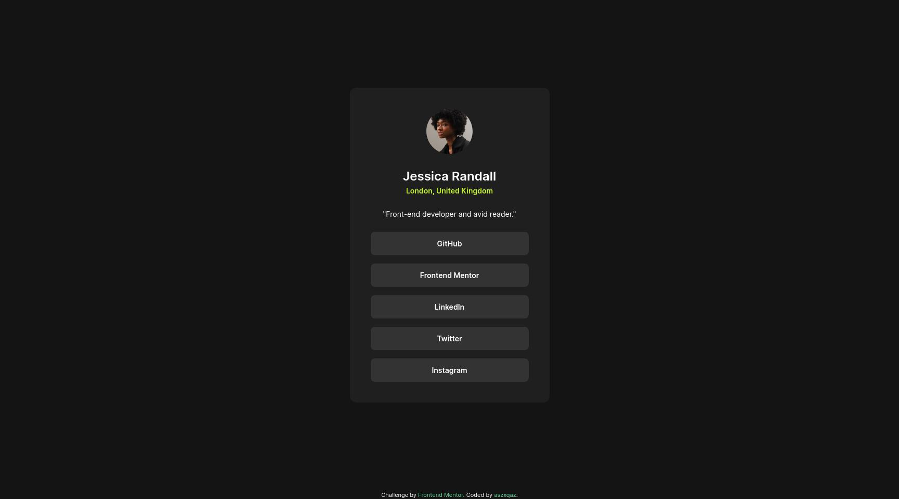

# Frontend Mentor - Social links profile solution

This is a solution to the [Social links profile challenge on Frontend Mentor](https://www.frontendmentor.io/challenges/social-links-profile-UG32l9m6dQ). Frontend Mentor challenges help you improve your coding skills by building realistic projects.

## Table of contents

- [Overview](#overview)
  - [Screenshot](#screenshot)
  - [Links](#links)
- [My process](#my-process)
  - [Built with](#built-with)
- [Author](#author)

## Overview

### Screenshot

### Links

- Solution URL: [https://github.com/aszxqaz/fm-social-links-profile](https://github.com/aszxqaz/fm-social-links-profile)
- Live Site URL: [https://aszxqaz.github.io/fm-social-links-profile](https://aszxqaz.github.io/fm-social-links-profile)

## My process

### Built with

- HTML
- CSS

## Author

- Frontend Mentor - [@aszxqaz](https://www.frontendmentor.io/profile/aszxqaz)
- GitHub - [@aszxqaz](https://www.github.com/aszxqaz)
